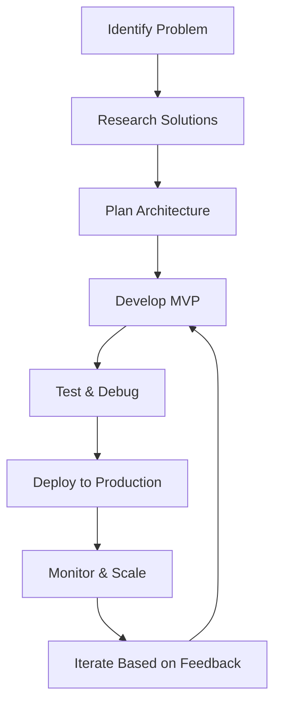

# 
👋 Hello, I'm Thejan Godagama

  

  
  
  

##  About Me

I'm a Computer Science & Software Engineering student passionate about creating innovative solutions through code and exploring the possibilities of AI technology. I specialize in building scalable applications and developing Telegram bots that serve tens of thousands of users.

- 🎓 Currently pursuing a BSc in Computer Science & Software Engineering
- 💻 Full-Stack Developer with expertise in Python and JavaScript ecosystems
- 🤖 AI enthusiast focusing on practical applications and integrations
- 🚀 Creator of Telegram bots with 70,000+ combined users
- 🌍 Based in Sri Lanka 🇱🇰

  

## 🛠️ Skills & Technologies

  
  
  
  
  
  
  
  
  
  
  
  
  
  

## 📱 Featured Projects

### Telegram Bots
| Project | Description | Users | Tech Stack |
|---------|-------------|-------|------------|
| [**TikTok Downloader Bot**](https://t.me/TikTokDownx_bot) | Telegram bot for downloading TikTok videos without watermarks, MP3 conversion & inline sharing | 32,000+ | Python, FFmpeg, MongoDB |
| [**Exam Countdown Bot**](https://t.me/Exam_Countdown_Bot) | Daily notifications and live countdowns for Sri Lankan A/L and O/L students with motivational quotes | 36,000+ | Python, Firebase, Telegram API |
| [**MtProxy Guard Bot**](https://t.me/MtProxySG_bot) | Multi-country proxy provider with premium tier system and daily updates | 2,100+ | Python, TDlib, MongoDB |
| [**IP Finder Bot**](https://t.me/IPfinderobo_bot) | IP address analysis, geolocation mapping, and security risk assessment | 2,000+ | Python, GeoIP API, Redis |

  
<b>🔮 AI Projects</b>

   
  <table>
    <tr>
      <th>Project</th>
      <th>Description</th>
      <th>Tech Stack</th>
    </tr>
    <tr>
      <td><b>ComfyUI Workflows</b></td>
      <td>Advanced image generation pipelines with custom node configurations</td>
      <td>ComfyUI, Python, PyTorch</td>
    </tr>
    <tr>
      <td><b>Hugging Face Integrations</b></td>
      <td>API implementations of various LLMs for practical applications</td>
      <td>Transformers, Python, FastAPI</td>
    </tr>
  </table>

  

## 🔄 My Development Workflow

## 📫 Connect With Me

I'm always open to new opportunities, collaborations, or just a friendly conversation about tech and AI.

  
  
  

  

  

---

  
⭐️ From <a href="https://github.com/thejan64go">Thejan Godagama</a> with 💻 and ❤️

  
May the force be with you!

